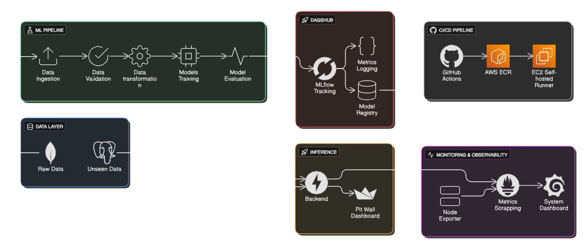
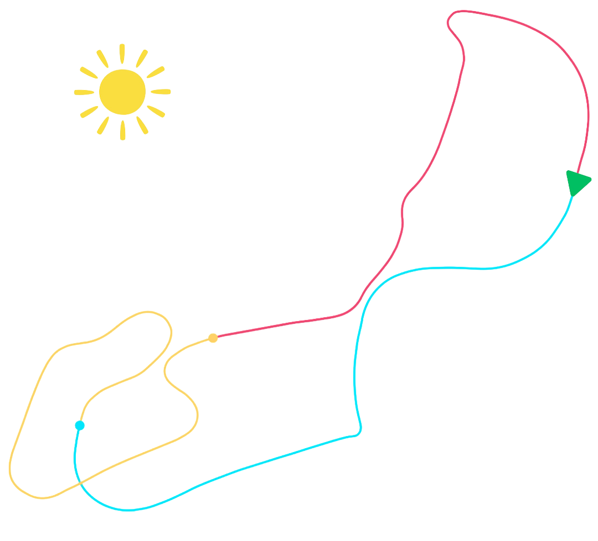

# 🏁 Race Telemetry - MLOps Platform

[](https://www.python.org/downloads/)
[](https://fastapi.tiangolo.com/)
[](https://streamlit.io/)
[](https://www.docker.com/)
[](https://aws.amazon.com/)
[](https://mlflow.org/)
[](https://prometheus.io/)
[](https://grafana.com/)

Production-oriented MLOps platform for real-time Motorsports telemetry analysis with automated model training, Pit Wall Monitoring Dashboard ,drift detection, and production deployment on AWS infrastructure.

## 🏗️ System Architecture



## 📊 Dataset Overview

**Source**: [FM7 Rio de Janeiro Race Telemetry](https://www.kaggle.com/datasets/alexhexan/fm7-rio-de-janeiro-race-telemetry)

This dataset contains race telemetry data recorded from the game Forza Motorsport 7 during a full race session on the Rio de Janeiro circuit. It captures per-car, time-series telemetry describing vehicle motion, control inputs, and race progress throughout the event.

The data includes information related to:
- Car state (position, velocity, orientation)
- Driver inputs (throttle, brake)
- Race context (lap number, lap time, race position)
- Track and session metadata

Each row represents a telemetry snapshot at a specific moment in time, making the dataset suitable for lap analysis, performance comparison, visualization, and machine-learning experiments related to motorsport analytics.

This dataset is sourced from in-game telemetry and reflects realistic racing behavior within the constraints of the simulation environment.

### Rio de Janeiro Circuit
<p align="center">
  
</p>

## 🎯 Dashboard

### Pit Wall Interface


**Real-time Components**:
- ML predictions (lap time, gear, behavior)
- Live telemetry charts
- Vehicle attitude display
- Track position overlay

### System Monitoring


**Monitoring Metrics**:
- Inference latency & throughput
- Feature drift detection (PSI)
- System resource utilization
- Model performance tracking

## 🤖 Machine Learning Models

### Lap Time Prediction (XGBoost Regression)
- **Target**: `current_lap_time`
- **Features**: Speed, RPM, power, torque, boost, tire temperature etc.
- **Hyperparameters**: 600 estimators, 0.03 learning rate, depth 4

### Gear Optimization (Random Forest Classification)
- **Target**: `gear`
- **Features**: Speed, RPM, throttle position, track position etc.
- **Hyperparameters**: 20 estimators, depth 4, min samples 100

### Driving Behavior Clustering (K-Means)
- **Clusters**: 2 (Conservative vs Aggressive)
- **Analysis**: Wheel slip, steering variance, tire stress patterns etc.
- **Key Differentiators**: Slip ratios, RPM variability, steering corrections

## 🔄 MLOps Pipeline

### Training Pipeline
```bash
python main.py
```

**Execution Flow**:
1. **Data Ingestion**: MongoDB Atlas → CSV extraction
2. **Data Validation**: Schema compliance & quality checks
3. **Feature Engineering**: Temporal & vehicle dynamics feature enginerring 
4. **Model Training**: Multi-model training (regression/classification/clustering)
5. **Model Evaluation**: Performance metrics & DagsHub tracking

### Inference Pipeline
- PostgreSQL data fetching
- Real-time model loading from DagsHub
- Multi-model prediction execution
- Drift detection & alerting
- Prometheus metrics collection

## 📈 Monitoring & Drift Detection

### Population Stability Index (PSI)
- **Monitored Features**: Speed, RPM, boost, torque, tire temperature
- **Threshold**: PSI > 0.2 triggers drift alert
- **Bins**: 10 percentile-based buckets

### Prometheus Metrics
- `api_requests_total`: Request counter
- `inference_latency_seconds`: Response time histogram
- `feature_psi`: Drift metrics by feature

## 🚀 Deployment Architecture

### Local Development
```bash
docker-compose up -d
```

### Production Deployment
```bash
# Automated via GitHub Actions
git push origin main
```

**Infrastructure**:
- **Container Registry**: AWS ECR
- **Compute**: EC2 with self-hosted runner
- **Orchestration**: Docker Compose
- **Monitoring**: Prometheus + Grafana + Node Exporter

### Service Endpoints
- **Pit Wall**: `http://localhost:8501`
- **API Docs**: `http://localhost:8000/docs`
- **Grafana**: `http://localhost:3000`
- **Prometheus**: `http://localhost:9090`

## 📁 Project Structure

```
Race-Telemetry/
├── src/                    # ML Pipeline Components
│   ├── components/         # Data processing modules
│   ├── models/             # Algorithm implementations
│   ├── pipeline/           # Training & inference workflows
│   └── utils/              # Shared utilities
├── backend/                # FastAPI Production API
├── notebooks/              # EDA & Research
├── config/                 # Configuration files
├── monitoring/             # Observability stack
├── artifacts/              # Model artifacts & datasets
├── .github/workflows/      # CI/CD automation
├── app.py                  # Streamlit dashboard
├── main.py                 # Training orchestrator
├── docker-compose.yml      # Local development
└── docker-compose.prod.yml # Production deployment
```

## ⚡ Performance Specifications

- **Inference Latency**: P95 < 100ms
- **Throughput**: 1000+ RPS sustained
- **Model Accuracy**: Lap time RMSE < 0.5s, Gear accuracy > 95%
- **Drift Detection**: Real-time PSI monitoring
- **Scalability**: Horizontal scaling ready

### Live demo - [click here](https://huggingface.co/spaces/Nasim435/Race-Telemetry)

## 🧠 Design Decisions

- Training and inference are decoupled to prevent production outages caused by failed retraining runs.
- Models are loaded dynamically at inference time to support versioned rollouts and rollback.
- Artifacts are externalized to avoid container immutability violations.
- CI/CD uses a self-hosted runner to enable Docker-in-Docker and direct EC2 deployment.

---
