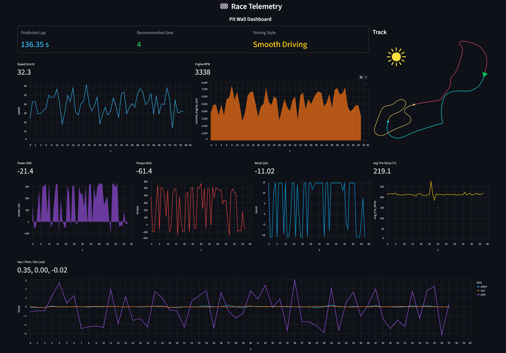
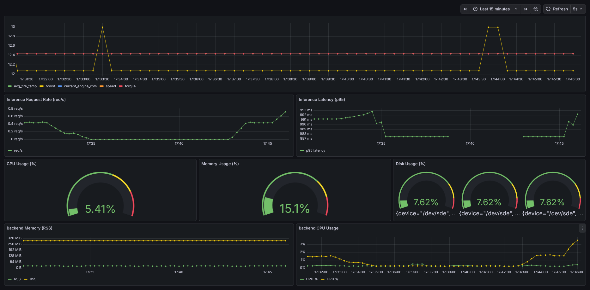

# 🏁 Race Telemetry - Production MLOps Platform

Enterprise-grade MLOps platform for real-time Formula 7 race car telemetry analysis with automated model training, drift detection, and production deployment on AWS infrastructure.

## 🏗️ System Architecture

```mermaid
graph TB
    subgraph "Data Layer"
        A[MongoDB Atlas<br/>Raw Telemetry Storage]
        B[PostgreSQL<br/>Production Data]
    end
    
    subgraph "ML Pipeline"
        A --> C[Data Ingestion]
        C --> D[Data Validation]
        D --> E[Feature Engineering]
        E --> F[Model Training<br/>XGBoost | RandomForest | KMeans]
        F --> G[Model Evaluation<br/>MLflow + DagsHub]
    end
    
    subgraph "Production Inference"
        B --> H[FastAPI Backend<br/>Real-time ML Inference]
        G --> H
        H --> I[Streamlit Dashboard<br/>Pit Wall Interface]
    end
    
    subgraph "Monitoring & Observability"
        H --> J[Prometheus<br/>Metrics Collection]
        J --> K[Grafana<br/>System Monitoring]
        L[Node Exporter] --> J
    end
    
    subgraph "CI/CD Pipeline"
        M[GitHub Actions] --> N[AWS ECR]
        N --> O[EC2 Self-hosted Runner]
        O --> P[Production Deployment]
    end
```

**Dataset Source**: [FM7 Rio de Janeiro Race Telemetry](https://www.kaggle.com/datasets/alexhexan/fm7-rio-de-janeiro-race-telemetry)

## 🎯 Production Dashboard

### Pit Wall Interface


**Real-time Components**:
- ML predictions (lap time, gear, behavior)
- Live telemetry charts
- Vehicle attitude display
- Track position overlay

### System Monitoring


**Monitoring Metrics**:
- Inference latency & throughput
- Feature drift detection (PSI)
- System resource utilization
- Model performance tracking

## 🤖 Machine Learning Models

### Lap Time Prediction (XGBoost Regression)
- **Target**: `current_lap_time`
- **Features**: Speed, RPM, power, torque, boost, tire temperature
- **Hyperparameters**: 600 estimators, 0.03 learning rate, depth 4

### Gear Optimization (Random Forest Classification)
- **Target**: `gear`
- **Features**: Speed, RPM, throttle position, track position
- **Hyperparameters**: 20 estimators, depth 4, min samples 100

### Driving Behavior Clustering (K-Means)
- **Clusters**: 2 (Conservative vs Aggressive)
- **Analysis**: Wheel slip, steering variance, tire stress patterns
- **Key Differentiators**: Slip ratios, RPM variability, steering corrections

## 📊 Exploratory Data Analysis

<div align="center">


</div>

<div align="center">


</div>

## 🔄 MLOps Pipeline

### Training Pipeline
```bash
python main.py
```

**Execution Flow**:
1. **Data Ingestion**: MongoDB Atlas → CSV extraction
2. **Data Validation**: Schema compliance & quality checks
3. **Feature Engineering**: Temporal & vehicle dynamics features
4. **Model Training**: Multi-model training (regression/classification/clustering)
5. **Model Evaluation**: Performance metrics & DagsHub tracking

### Inference Pipeline
- PostgreSQL data fetching
- Real-time model loading from DagsHub
- Multi-model prediction execution
- Drift detection & alerting
- Prometheus metrics collection

## 📈 Monitoring & Drift Detection

### Population Stability Index (PSI)
- **Monitored Features**: Speed, RPM, boost, torque, tire temperature
- **Threshold**: PSI > 0.2 triggers drift alert
- **Bins**: 10 percentile-based buckets

### Prometheus Metrics
- `api_requests_total`: Request counter
- `inference_latency_seconds`: Response time histogram
- `feature_psi`: Drift metrics by feature

## 🚀 Deployment Architecture

### Local Development
```bash
docker-compose up -d
```

### Production Deployment
```bash
# Automated via GitHub Actions
git push origin main
```

**Infrastructure**:
- **Container Registry**: AWS ECR
- **Compute**: EC2 with self-hosted runner
- **Orchestration**: Docker Compose
- **Monitoring**: Prometheus + Grafana + Node Exporter

### Service Endpoints
- **Pit Wall**: `http://localhost:8501`
- **API Docs**: `http://localhost:8000/docs`
- **Grafana**: `http://localhost:3000`
- **Prometheus**: `http://localhost:9090`

## 📁 Project Structure

```
Race-Telemetry/
├── src/                    # ML Pipeline Components
│   ├── components/         # Data processing modules
│   ├── models/            # Algorithm implementations
│   ├── pipeline/          # Training & inference workflows
│   └── utils/             # Shared utilities
├── backend/               # FastAPI Production API
├── notebooks/             # EDA & Research
│   └── eda_plots/        # Generated visualizations
├── config/                # Configuration files
├── monitoring/            # Observability stack
├── artifacts/             # Model artifacts & datasets
├── .github/workflows/     # CI/CD automation
├── app.py                # Streamlit dashboard
├── main.py               # Training orchestrator
├── docker-compose.yml    # Local development
└── docker-compose.prod.yml # Production deployment
```

## ⚡ Performance Specifications

- **Inference Latency**: P95 < 100ms
- **Throughput**: 1000+ RPS sustained
- **Model Accuracy**: Lap time RMSE < 0.5s, Gear accuracy > 95%
- **Drift Detection**: Real-time PSI monitoring
- **Scalability**: Horizontal scaling ready

---

**Built for production-grade Formula 7 telemetry analysis**

## 🔄 MLOps Pipeline

### Training Pipeline
```bash
python main.py
```

**Execution Flow**:
1. **Data Ingestion**: MongoDB Atlas → CSV extraction
2. **Data Validation**: Schema compliance & quality checks
3. **Feature Engineering**: Temporal & vehicle dynamics features
4. **Model Training**: Multi-model training (regression/classification/clustering)
5. **Model Evaluation**: Performance metrics & DagsHub tracking

### Inference Pipeline
- PostgreSQL data fetching
- Real-time model loading from DagsHub
- Multi-model prediction execution
- Drift detection & alerting
- Prometheus metrics collection

## 📈 Monitoring & Drift Detection

### Population Stability Index (PSI)
- **Monitored Features**: Speed, RPM, boost, torque, tire temperature
- **Threshold**: PSI > 0.2 triggers drift alert
- **Bins**: 10 percentile-based buckets

### Prometheus Metrics
- `api_requests_total`: Request counter
- `inference_latency_seconds`: Response time histogram
- `feature_psi`: Drift metrics by feature

## 🚀 Deployment Architecture

### Local Development
```bash
docker-compose up -d
```

### Production Deployment
```bash
# Automated via GitHub Actions
git push origin main
```

**Infrastructure**:
- **Container Registry**: AWS ECR
- **Compute**: EC2 with self-hosted runner
- **Orchestration**: Docker Compose
- **Monitoring**: Prometheus + Grafana + Node Exporter

### Service Endpoints
- **Pit Wall**: `http://localhost:8501`
- **API Docs**: `http://localhost:8000/docs`
- **Grafana**: `http://localhost:3000`
- **Prometheus**: `http://localhost:9090`

## 📁 Project Structure

```
Race-Telemetry/
├── src/                    # ML Pipeline Components
│   ├── components/         # Data processing modules
│   ├── models/            # Algorithm implementations
│   ├── pipeline/          # Training & inference workflows
│   └── utils/             # Shared utilities
├── backend/               # FastAPI Production API
├── notebooks/             # EDA & Research
│   └── eda_plots/        # Generated visualizations
├── config/                # Configuration files
├── monitoring/            # Observability stack
├── artifacts/             # Model artifacts & datasets
├── .github/workflows/     # CI/CD automation
├── app.py                # Streamlit dashboard
├── main.py               # Training orchestrator
├── docker-compose.yml    # Local development
└── docker-compose.prod.yml # Production deployment
```

## ⚡ Performance Specifications

- **Inference Latency**: P95 < 100ms
- **Throughput**: 1000+ RPS sustained
- **Model Accuracy**: Lap time RMSE < 0.5s, Gear accuracy > 95%
- **Drift Detection**: Real-time PSI monitoring
- **Scalability**: Horizontal scaling ready

---

**Built for production-grade Formula 7 telemetry analysis**